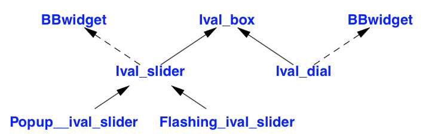
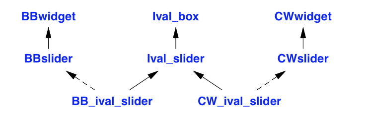
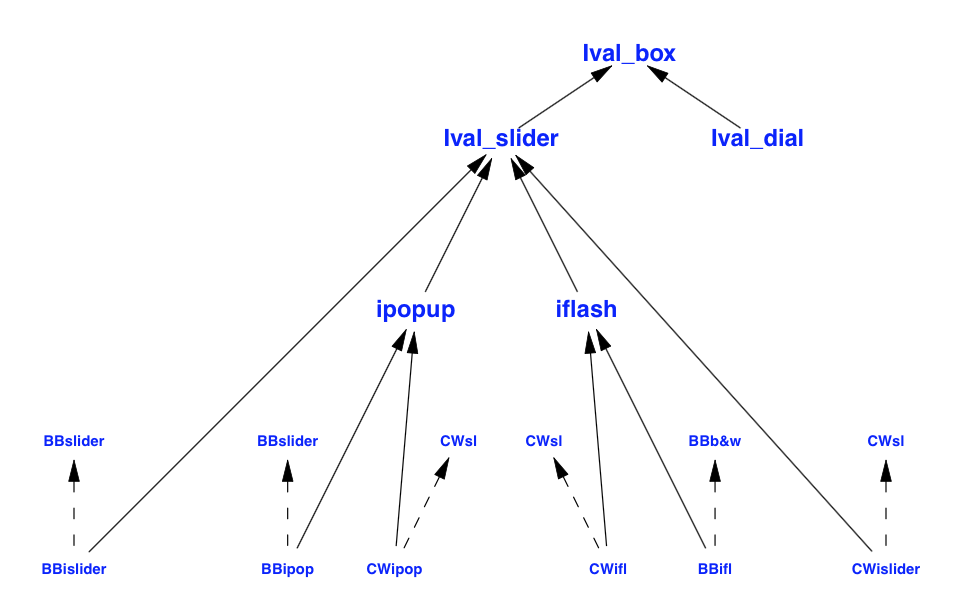
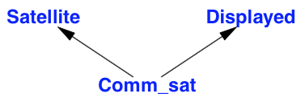
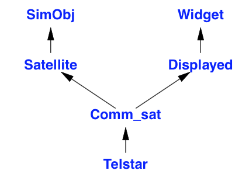
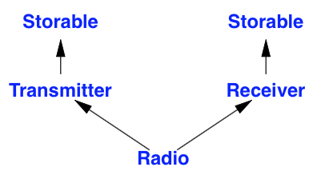
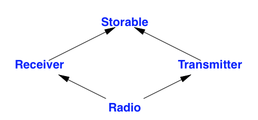

##A class must be defined to be used a a base

```cpp
class Employee; // declaration only, no definition
class Manager : public Employee { // error: Employee not defined // ...
};
```

#Class Hierarchy

```cpp
class Temporary { /* ... */ };
class Assistant : public Employee { /* ... */ };
class Temp : public Temporary, public Assistant { /* ... */ }; 
class Consultant : public Temporary, public Manager { /* ... */ };
```

###Given a pointer of type Base∗, to which derived type does the object pointed to really belong?

1. Ensure that only objects of a single type are 
pointed to (§3.4, Chapter 23). 
- Place a type field in the base class for the functions to inspect.
- Use dynamic_cast (§22.2, §22.6).
- Use virtual functions (§3.2.3, §20.3.2).

###For larger class hierarchies it can be difficult to be sure that you actually override the function you meant to override
```cpp
struct B0 {
void f(int) const;
virtual void g(double); };
struct B1 : B0 { /* ... */ };
struct B2 : B1 { /* ... */ }; 
struct B3 : B2 { /* ... */ }; 
struct B4 : B3 { /* ... */ }; 
struct B5 : B4 { /* ... */ };
struct D : B5 {
void f(int) const;
void g(int); virtual int h();
};
```
1. `B0::f()` is not virtual, so you can’t override it, only hide it
- Most likely,`D::g()`just hides B0::g().
- Most likely,`D::h()`  is introducing a brand-new virtual function.

```cpp
struct D : B5 {
void f(int) const override; // error: B0::f() is not virtual
void g(int) override;       // error: B0::f() takes a double argument
virtual int h() override;   // error: no function h() to override
};
```

```cpp
struct Base { 
    void f(int);
};
struct Derived : Base { 
    void f(double);
};
void use(Derived d) {
    d.f(1); // call Derived::f(double) Base& br = d
    br.f(1); // call Base::f(int)
}
```

##Return Type Relaxation
Consider a class hierarchy representing different kinds of expressions. In addition to the opera- tions for manipulating expressions, the base class Expr would provide facilities for making new expression objects of the various expression types:

```cpp
class Expr { public:
Expr(); // default constructor 
Expr(const Expr&); // copy constructor 
virtual Expr∗ new_expr() =0;
virtual Expr∗ clone() =0;
// ... 
};
```

`new_expr()` makes a default object of the type of the expression and clone() makes a copy of the object. Both will return an object of some specific class derived from Expr. They can never just return a ‘‘plain Expr’’ because Expr was deliberately and appropriately declared to be an abstract class.

###This means that given an object of class Expr, a user can create a new object of ‘‘just the same type.’’ For example:

```cpp
void user(Expr∗ p) {
Expr∗ p2 = p􏰀>new_expr();
// ... }
```

###Pointers to Function Members
```cpp
using Pstd_mem = void (Std_interface::∗)(); void f(Std_interface∗ p)
{
    Pstd_mem s = &Std_interface::suspend; 
    p-􏰀>suspend();
    p􏰀>∗s();
}
```

##Implementation Inheritance
IvalBox

```cpp
class Ival_box { 
public:
    virtual int get_value() = 0;
    virtual void set_value(int i) = 0; 
    virtual void reset_value(int i) = 0; 
    virtual void prompt() = 0;
    virtual bool was_changed() const = 0; 
    virtual  ̃Ival_box() { }
};
```



```cpp
class Ival_box { /* ... */ }; 
class Ival_slider
    : public Ival_box, protected BBwidget { /* ... */ }; 
class Ival_dial
    : public Ival_box, protected BBwidget { /* ... */ }; 
class Flashing_ival_slider
    : public Ival_slider { /* ... */ }; 
class Popup_ival_slider
    : public Ival_slider { /* ... */ };
```

```cpp
class Ival_box { /* ... */ }; class BB_ival_slider
: public Ival_box, protected BBwidget { /* ... */ }; class CW_ival_slider
: public Ival_box, protected CWwidget { /* ... */ }; // ...
```

if the ‘‘Big Bucks Inc.’’ system has a slider class, we can derive our Ival_slider directly from the BBslider:




```cpp
class Ival_box { /* ... */ }; 
class Ival_slider
    : public Ival_box { /* ... */ }; 
class Ival_dial
    : public Ival_box { /* ... */ }; 
class Flashing_ival_slider
    : public Ival_slider { /* ... */ }; 
class Popup_ival_slider
    : public Ival_slider { /* ... */ };
    
    
class BB_ival_slider
    : public Ival_slider, 
      protected BBslider { /* ... */ };
class BB_flashing_ival_slider
    : public Flashing_ival_slider, 
      protected BBwidget_with_bells_and_whistles { /* ... */ };
class BB_popup_ival_slider
    : public Popup_ival_slider, 
      protected BBslider { /* ... */ };
class CW_ival_slider
    : public Ival_slider, 
      protected CWslider { /* ... */ };
// ...
```



##Factories
```cpp
class BB_maker : public Ival_maker { // make BB versions public:
    Ival_dial∗ dial(int, int) override; 
    Popup_ival_slider∗ popup_slider(int, int) override; // ...
};
class LS_maker : public Ival_maker { // make LS versions public:
    Ival_dial∗ dial(int, int) override; 
    Popup_ival_slider∗ popup_slider(int, int) override; // ...
};
```

```cpp
Ival_dial∗ BB_maker::dial(int a, int b) {
    return new BB_ival_dial(a,b); 
}
Ival_dial∗ LS_maker::dial(int a, int b) {
    return new LS_ival_dial(a,b); 
}
```

```cpp
void user(Ival_maker& im) {
    unique_ptr<Ival_box> pb {im.dial(0,99)}; // create appropriate dial
    // ... 
}



BB_maker BB_impl; 
LS_maker LS_impl;

void driver() {
    user(BB_impl); user(LS_impl);
}
```

#Satellites


```cpp
class Comm_sat : public Satellite, public Displayed 
{ 
public:
    // ... 
};

void f(Comm_sat& s) {
    s.draw();
    Pos p = s.center(); s.transmit();
}

void highlight(Displayed*);
Pos center_of_gravity(const Satellite*);

void g(Comm_sat∗ p) {
    highlight(p); // pass a pointer to the Displayed part of the Comm_sat
    Pos x = center_of_gravity(p); // pass a pointer to the Satellite part of the Comm_sat 
}    
```

```cpp
class Satellite { 
public:
    virtual Pos center() const = 0;
// ... 
};
class Displayed { 
public:
    virtual void draw() = 0;
// ... 
};

class Comm_sat : public Satellite, public Displayed { 
public:
Pos center() const override; // override Satellite::center() 
void draw() override; // override Displayed::draw() // ...
};

```

###Disambiguation
```cpp
void f(Comm_sat& cs) {
    Debug_info di = cs.get_debug(); 
    di = cs.Satellite::get_debug();
    di = cs.Displayed::get_debug();
}


class Comm_sat : public Satellite, public Displayed { 
public:
    Debug_info get_debug() // override Comm_sat::get_debug() and Displayed::get_debug() 
    {
        Debug_info di1 = Satellite::get_debug(); 
        Debug_info di2 = Displayed::get_debug(); 
        return merge_info(di1,di2);
    }
};
```

###Mapping layer



```cpp
class Satellite : public SimObj {
    // map SimObj facilities to something easier to use for Satellite simulation
public:
    virtual Debug_info get_debug(); // call SimObj::DBinf() and extract information // ...
};
class Displayed : public Widget {
// map Widget facilities to something easier to use to display Satellite simulation results
public:
    virtual Debug_info get_debug(); // read Widget data and compose Debug_info // ...
};
```

###Repeated use of a Base class


```cpp

struct Storable { // persistent storage virtual string get_file() = 0;
    virtual void read() = 0;
    virtual void write() = 0;
    virtual ~Storable() { } 
};

class Transmitter : public Storable { public:
    void write() override;
// ... 
};
class Receiver : public Storable { public:
    void write() override;
// ... 
};
class Radio : public Transmitter, public Receiver 
{ 
public:
    string get_file() override; 
    void read() override; 
    void write() override;
// ...
};
```
This assumes Storable is an interface. 
##What if Storable was a class with data?
```cpp
class Storable { public:
Storable(const string& s); 
    virtual void read() = 0; 
    virtual void write() = 0; 
    virtual  ̃Storable();
protected:
    string file_name;
    Storable(const Storable&) = delete;
    Storable& operator=(const Storable&) = delete; 
};
```


```cpp

struct Storable { // persistent storage virtual string get_file() = 0;
    virtual void read() = 0;
    virtual void write() = 0;
    virtual ~Storable() { } 
};

class Transmitter : public virtual Storable { public:
    void write() override;
// ... 
};
class Receiver : public virtual  Storable { public:
    void write() override;
// ... 
};
class Radio : public Transmitter, public Receiver 
{ 
public:
    string get_file() override; 
    void read() override; 
    void write() override;
// ...
};
```

##Calling a virtual Class member once only

```cpp
class Window { 
public:
// basic stuff
virtual void draw(); 
};
class Window_with_border : public virtual Window { // border stuff
protected:
    void own_draw(); // display the border
public:
    void draw() override;
};
class Window_with_menu : public virtual Window { // menu stuff
protected:
    void own_draw(); // display the menu
public:
    void draw() override;
};

class Clock : public Window_with_border, public Window_with_menu { // clock stuff
protected:
    void own_draw(); // display the clock face and hands
public:
    void draw() override;
};


void Window_with_border::draw() {
    Window::draw();
    own_draw(); // display the border 
}

void Window_with_menu::draw() {
    Window::draw();
    own_draw(); // display the menu 
}
void Clock::draw() {
    Window::draw(); Window_with_border::own_draw(); 
    Window_with_menu::own_draw();
    own_draw(); // display the clock face and hands
}
```

##`Dynamic_cast`

Assume that ‘‘the system’’ invokes `my_event_handler()` with a pointer to a `BBwindow`, where an activity has occurred. I then might invoke my application code using `Ival_box`’s `do_something()`:

```cpp
void my_event_handler(BBwindow∗ pw) {
    if (auto pb = dynamic_cast<Ival_box∗>(pw)) { // does pw point to an Ival_box? 
        // ...
        int x = pb􏰀>get_value(); // use the Ival_box
        // ... 
    }
    else {
        // ... oops! cope with unexpected event ...
    } 
}
```


```cpp

class My_slider: public Ival_slider {  
// polymorphic base (Ival_slider has virtual functions)
    //...
};
class My_date : public Date {  
// base not polymorphic (Date has no virtual functions)
    //...
};
void g(Ival_box∗ pb, Date∗ pd) {
    My_slider∗ pd1 = dynamic_cast<My_slider∗>(pb);  // OK
    My_date∗ pd2 = dynamic_cast<My_date∗>(pd);     // error: Date not polymorphic
}

```